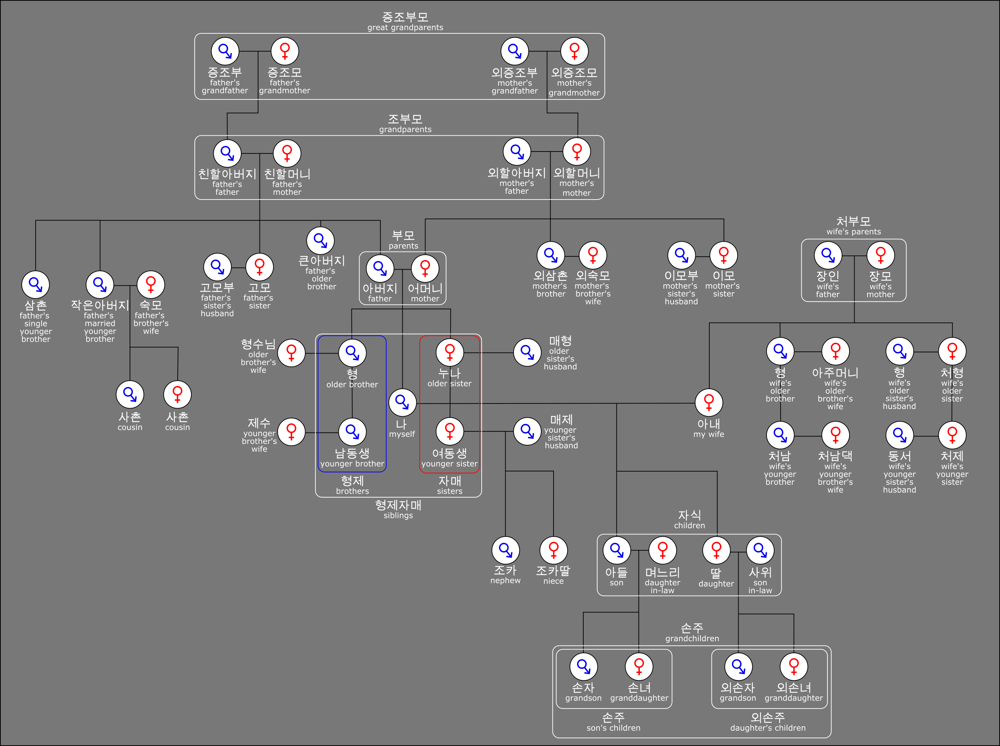
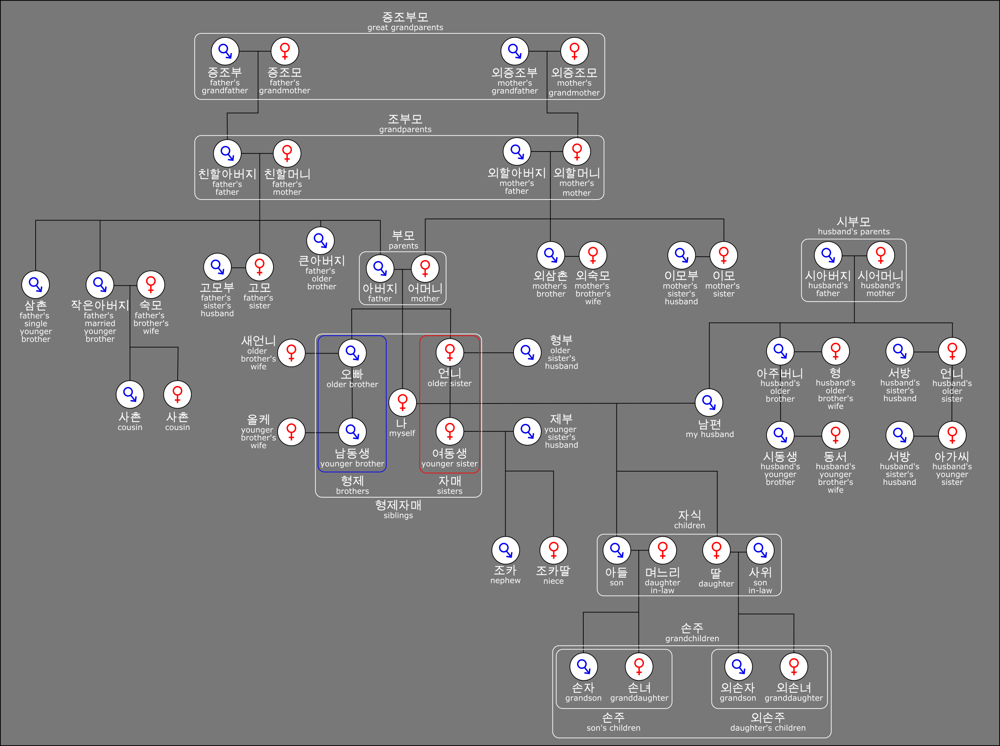

# Korean Family Tree SVG

Attempting to aggregate as much korean family vocabulary into a single diagram as possible. The vector image will also have clearly defined metadata, an organized DOM, and entity identifiers for easy integration (ex. into a webpage with interactivity).

There are two major versions of this tree (one for a male subject, one for a female subject) that are difficult to show in the same space, so for now they are separated into layers named with the `_male` or `_female` suffix. Elements that are common for both versions do not have either of these suffixes.

# Raster Exports

Exported raster images are included in `/images/export/`.

## Male 남성

## Female 여성

